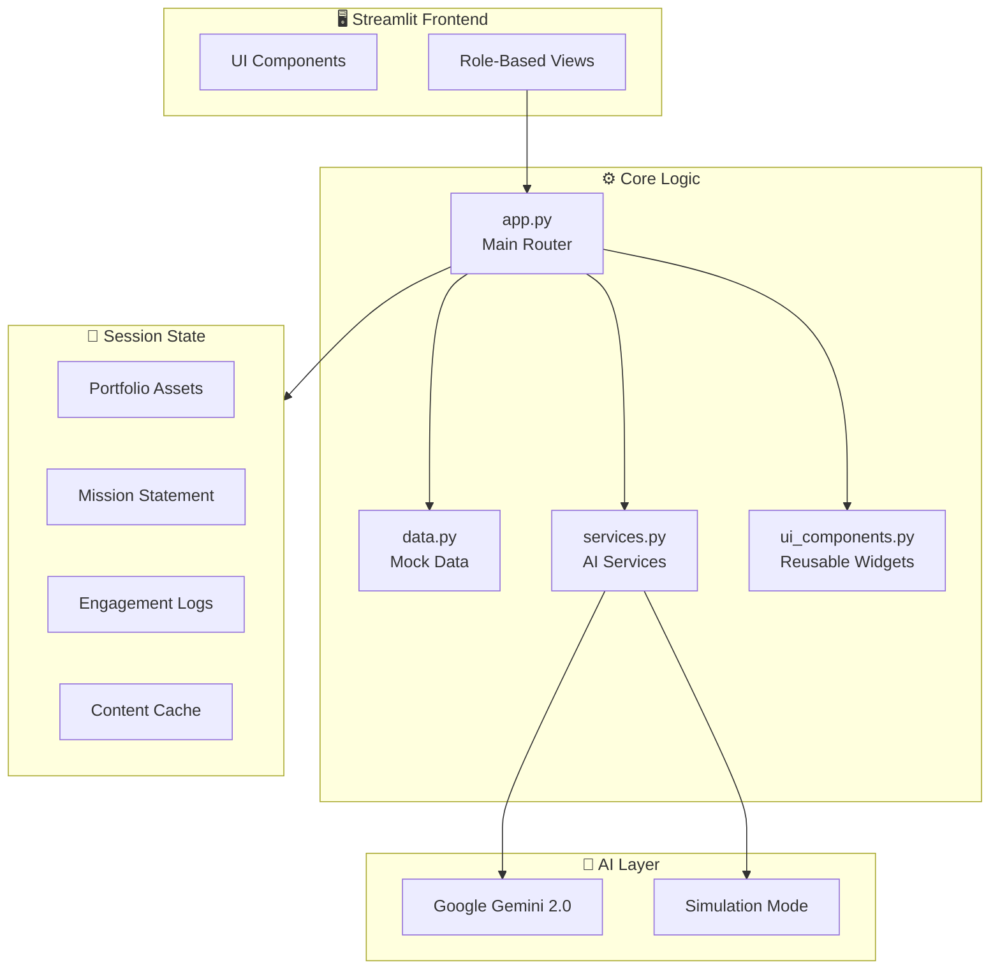
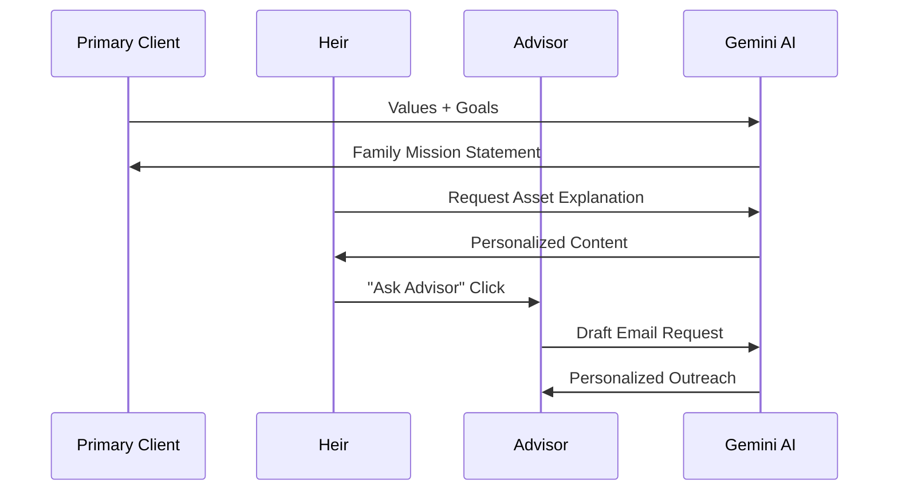

<p align="center">
  
  
  
  
</p>

# 🔄 LegacyLoop

> **Bridging Generations Through Wealth Understanding**

LegacyLoop is an AI-powered prototype that connects wealthy families, their heirs, and financial advisors through personalized, engaging experiences. Built for the modern wealth management landscape where **70% of wealth transfers fail** due to communication gaps between generations.

---

## ✨ Features

### 👴 Primary Client View (Patriarch/Matriarch)
- **Portfolio Management** — Add, edit, and delete assets with full CRUD functionality
- **8 Asset Types** — Equities, Index Funds, Bonds, Real Estate, Crypto, Private Equity, and more
- **Family Mission Builder** — Define core values and wealth vision
- **AI-Generated Constitution** — Gemini drafts formal yet warm legacy statements
- **Portfolio Overview** — At-a-glance view of family holdings with real-time totals

### 👦 Heir View (Next Generation)
- **TikTok-Style Legacy Cards** — Swipeable assets with gamified explanations
- **Age-Appropriate Content** — AI tailors explanations to interests (gaming, tech, crypto analogies)
- **One-Tap Engagement** — "Ask Advisor" buttons to explore further

### 👩‍💼 Advisor View (Financial Advisor)
- **Engagement Pulse Dashboard** — Real-time metrics on heir activity
- **Activity Feed** — Timestamped interaction logs
- **AI Email Drafting** — Personalized outreach with one click

---

## 🏗️ Architecture



### Data Flow



---

## 🚀 Quick Start

### Prerequisites
- Python 3.9+
- [Google Gemini API Key](https://aistudio.google.com/app/apikey) (optional - works in simulation mode)

### Installation

```bash
# Clone the repository
git clone https://github.com/yourusername/LegacyLoop.git
cd LegacyLoop

# Create virtual environment
python -m venv venv

# Activate (Windows)
.\venv\Scripts\Activate.ps1
# Activate (Mac/Linux)
source venv/bin/activate

# Install dependencies
pip install -r requirements.txt
```

### Configuration

```bash
# Copy the secrets template
cp .streamlit/secrets.toml.example .streamlit/secrets.toml

# Edit with your API key
# GEMINI_API_KEY = "your-api-key-here"
```

### Run

```bash
streamlit run app.py
```

Open [http://localhost:8501](http://localhost:8501) in your browser.

---

## 📁 Project Structure

```
LegacyLoop/
├── app.py                 # Main Streamlit application
├── data.py                # Portfolio data, asset CRUD operations
├── services.py            # Gemini AI integration layer
├── ui_components.py       # Reusable styled components
├── requirements.txt       # Python dependencies
├── .streamlit/
│   ├── secrets.toml       # API keys (gitignored)
│   └── secrets.toml.example
├── .env.example           # Environment template
├── LICENSE                # MIT License
└── README.md
```

---

## 🎮 Demo Modes

| Mode | Description |
|------|-------------|
| **Simulation** | Works without API key using smart fallbacks |
| **Live AI** | Full Gemini integration with personalized content |

The app gracefully degrades to simulation mode if no API key is configured.

---

## 🛠️ Tech Stack

| Component | Technology |
|-----------|------------|
| **Frontend** | Streamlit |
| **AI** | Google Gemini 2.0 Flash |
| **Language** | Python 3.9+ |
| **Styling** | Custom CSS with glassmorphism |

---

## 🤝 Contributing

Contributions are welcome! Please see [CONTRIBUTING.md](CONTRIBUTING.md) for guidelines.

1. Fork the repository
2. Create a feature branch (`git checkout -b feature/amazing-feature`)
3. Commit your changes (`git commit -m 'Add amazing feature'`)
4. Push to the branch (`git push origin feature/amazing-feature`)
5. Open a Pull Request

---

## 📝 License

This project is licensed under the MIT License - see the [LICENSE](LICENSE) file for details.

---

## 🙏 Acknowledgments

- Built with [Streamlit](https://streamlit.io/)
- Powered by [Google Gemini](https://deepmind.google/technologies/gemini/)
- Inspired by the wealth transfer challenge facing $84 trillion in assets

---

<p align="center">
  <strong>Made with ❤️ for bridging generational wealth gaps</strong>
</p>
